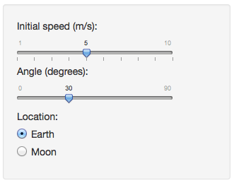

## Concept

The [Ball Motion app](https://adoroszlai.shinyapps.io/ball_motion) simulates a ball thrown to the air.  It demonstrates how gravity and initial velocity (speed and angle) affect the trajectory of the ball.



--- 

## Functionality

```{r,echo=FALSE}
source('functions.R')
g <- 9.80665
initial_speed <- 6
angle <- 42
```

The app draws 4 plots that dynamically adapt to user input.  Example with ball thrown at `r initial_speed` m/s initial speed at `r angle` degrees on the Earth:

```{r,echo=FALSE}
create_plot(
  calculate_trajectory(g, initial_speed, angle),
  calculate_plot_limits(g, initial_speed)
)
```

---

## Purpose

Users can find out answers for the following questions and more:

  1. What is the best angle to throw the ball in order to make it land the farthest possible?
  1. Does initial speed affect the shape of the trajectory?
  1. How does the strength of gravity affect the time until the ball hits the ground?

---

## Acknowledgements

Thanks to Louis A. Bloomfield's [How Things Work](https://www.coursera.org/course/howthingswork1) course for the idea.

The app's [source is available on github](https://github.com/adoroszlai/DataProductsAssignment/tree/master).